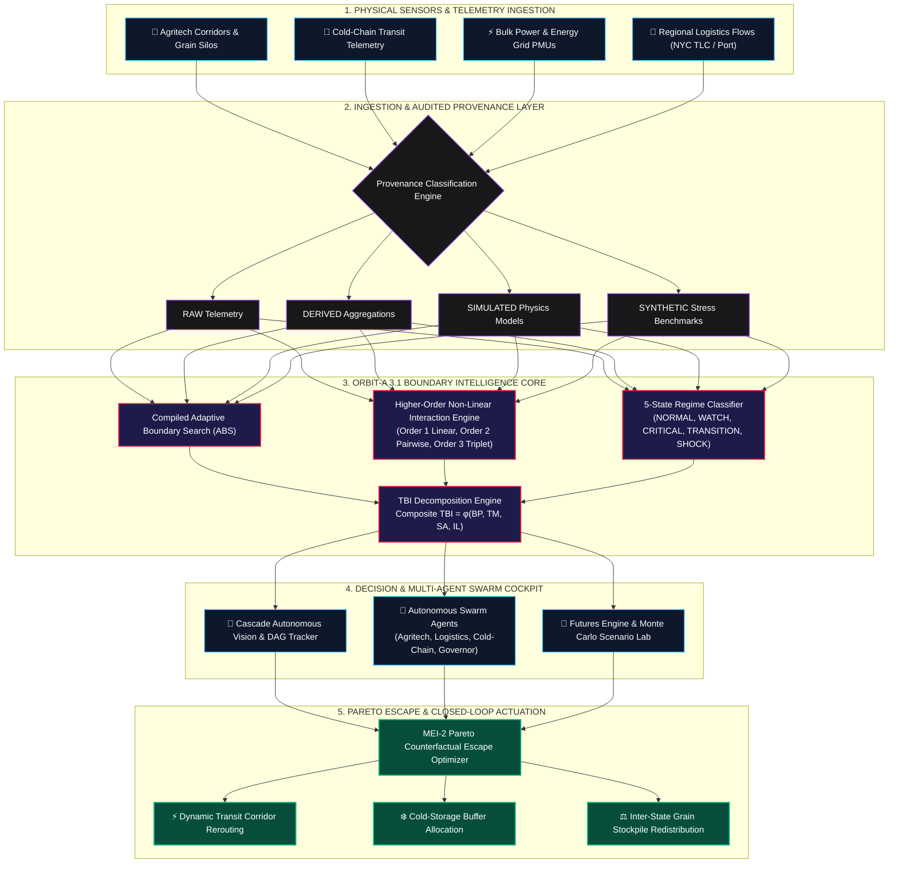
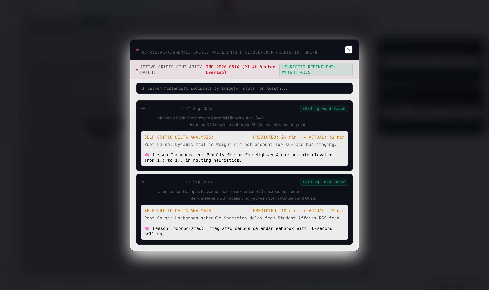

# 🛡️ AEGIS ZERO
### Autonomous Food Resilience & Cascade Engine (ORBIT-A 3.1)

<div align="center">
  
</div>

<br />

<div align="center">

[](https://www.typescriptlang.org/)
[](https://vitejs.dev/)
[](https://react.dev/)
[](https://nothing.tech)
[](./src/orbit/__tests__/)
[-00E676.svg?style=for-the-badge)](./experiments/results/)
[](./LICENSE)

</div>

---

## 🌟 Executive Summary

**AEGIS ZERO** is an industrial-grade autonomous resilience intelligence and catastrophic cascade prevention platform tailored for modern cyber-physical food supply ecosystems. Powered by the **ORBIT-A 3.1** engine and built with a high-contrast, minimalist **NTHG OS (Nothing OS)** monochrome design system, the engine detects non-equilibrium regime shifts, computes boundary transition distances in real-time, discovers higher-order non-linear systemic risks, and deploys Pareto-optimal counterfactual escape interventions before irreversible chain collapse occurs.

---

## 🔄 System Architecture & Data Flow

The complete end-to-end data processing and intervention pipeline operates across five coordinated layers:



---

## 🖥️ Comprehensive Project Pages Walkthrough

AEGIS ZERO features 7 specialized operational pages accessible via the persistent Left Command Rail:

```
[AZ ZERO]
├── [1] OVERVIEW    ── Tactical Landing & Interactive Particle Sandbox
├── [2] WORLD       ── Physical-Digital Twin 3D Geospatial Topology
├── [3] CASCADE     ── Failure Propagation DAG & Vision Scanner
├── [4] AGENTS      ── Autonomous Multi-Agent Swarm War Room
├── [5] FUTURES     ── Multi-Timeline Simulation & Monte Carlo Lab
├── [6] ORBIT LAB   ── BTD Radar Sweeper & 4-Core TBI Decomposition
└── [7] MEMORY      ── Episodic Incident Ledger & Audit Trail
```

---

### 1. `OVERVIEW` — System Command & Tactical Landing

The **Overview** page acts as the operational entry portal for AEGIS ZERO, featuring an interactive $N=1400$ sand grain particle physics simulator and quick-launch telemetry cards.

<div align="center">
  
</div>

#### Key Capabilities:
- **Interactive Physics Canvas**: Real-time particle simulator modeling shockwaves, dispersion, and fluid resilience dynamics.
- **System Readiness Telemetry**: Instant readouts for system status, active nodes count, risk posture, and equilibrium states.
- **Direct Cockpit Navigation**: One-click deep navigation into any specialized operational module.
- **Project Purpose & Blueprint**: Comprehensive modal detailing mission objectives, mathematical resilience formulas, and threat matrices.

---

### 2. `WORLD` — Physical-Digital Twin & Supply Topology

The **World** page renders a live 3D geospatial visualization of the entire food supply network, modeling physical hubs, processing plants, cold-storage centers, and transit couriers.

<div align="center">
  
</div>

#### Key Capabilities:
- **Interactive 3D Supply Matrix**: Powered by Three.js with full rotation, zoom, and spatial panning across geographical supply regions.
- **Live Courier Transit Tracking**: Visualizes active refrigerated trucks, cargo freight, and delivery couriers moving in real-time along road corridors.
- **Node Telemetry & Inspection**: Clicking any facility opens a detailed **Node Inspect Card** showing inventory levels, temperature telemetry, failure probability, and betweenness centrality.
- **Multi-Angle Camera Modes**: Toggle seamlessly between `Orbit Mode`, top-down `God's Eye Mode`, and automated `Courier Tracking Mode`.
- **Right Intelligence Deck**: Context-aware telemetry stream showing live regional alerts, stress levels, and one-click chaos disruption triggers.

---

### 3. `CASCADE` — Cascade Autonomous Vision & DAG Tracker

The **Cascade** page pairs topological graph modeling with real-time optical computer vision to diagnose and halt domino failure cascades across interconnected supply hubs.

<div align="center">
  
</div>

#### Key Capabilities:
- **Causal Flow DAG**: Interactive Directed Acyclic Graph displaying real-time causal risk vectors between hubs (Processing Plant → Main Cold Depot → Regional Distribution → Urban Hubs).
- **Computer Vision Optical Scanner**: Real-time camera feed analysis tracking depot loading dock queues, vehicle flow rate, thermal leakage flags, and physical bottlenecks.
- **Domino Collapse Propagation**: Simulates how a localized failure (e.g. Depot Chiller compressor failure) triggers upstream and downstream node overloads.
- **Automated Barrier Calculation**: Pinpoints exact isolation points where emergency rerouting can quarantine the disruption.

---

### 4. `AGENTS` — Autonomous Multi-Agent Swarm War Room

The **Agents** page is the autonomous nerve center where four specialized AI agents collaborate, debate, and vote on intervention strategies to preserve system stability.

<div align="center">
  
</div>

#### The 4 Swarm Agents:
1. 🌾 **Agritech Specialist**: Monitors crop yield sensors, weather disruptions, soil moisture indices, and harvest logistics.
2. 🚚 **Logistics Dispatcher**: Calculates dynamic routing detours, highway blockades, and fuel-optimal transit rerouting.
3. ❄️ **Cold-Chain Auditor**: Evaluates refrigeration health, thermal decay rates of perishables, and cold-storage buffer capacities.
4. ⚖️ **Allocation Governor**: Enforces equitable food distribution algorithms to prevent acute supply deficits in vulnerable communities.

#### Key Capabilities:
- **Consensus Voting Matrix**: Displays live agent vote weights, confidence percentages, and unanimous/majority consensus status.
- **Sub-Second Execution Log**: Immutable audit stream capturing agent deliberations, trigger detections, and dispatched countermeasures.
- **One-Click Autonomous Hand-off**: Allows human-in-the-loop confirmation or hands-off sovereign autonomous intervention.

---

### 5. `FUTURES` — Future Lab & Scenario Simulation Engine

The **Futures** page enables predictive stress testing, simulating alternative multi-timeline futures and evaluating recovery trajectories under extreme shocks.

<div align="center">
  
</div>

#### Key Capabilities:
- **Multi-Timeline Branching**: Explore and compare alternative future plans (e.g. *Plan Alpha: High-Elevation Chilled Bypass* vs. *Plan Beta: Regional Stockpile Drawdown*).
- **Monte Carlo Recovery Projections**: Generates 95% confidence bands for caloric recovery time ($T_{\text{recovery}}$), inventory depletion curves, and service reliability.
- **Risk Mitigation Scorecard**: Compares deployment cost, execution latency, and systemic impact scores across candidate intervention plans.
- **Live Deployment Pipeline**: Deploy approved emergency plans directly to active courier fleets and distribution centers.

---

### 6. `ORBIT LAB` — ORBIT-A 3.1 Lab & BTD Radar Command Center

The **Orbit Lab** is the mathematical core of AEGIS ZERO, housing the cutting-edge **ORBIT-A 3.1** boundary resilience and higher-order interaction algorithms.

<div align="center">
  
</div>

#### Key Capabilities:
- **360° Boundary Transition Distance (BTD) Radar**: High-contrast directional radar sweeping multi-dimensional operational space to gauge distance to critical collapse thresholds.
- **TBI 4-Core Quantities Decomposition**:
  1. **Boundary Proximity (BP)**: Current closeness to constraint boundary surfaces.
  2. **Transition Momentum (TM)**: Velocity and acceleration vectors towards failure.
  3. **Structural Amplification (SA)**: Topological amplification multiplier from network severance.
  4. **Intervention Leverage (IL)**: Efficiency and feasibility of counterfactual escape maneuvers.
- **Higher-Order Non-Linear Interaction Engine**: Dynamic screening of Order 1 (linear), Order 2 (pairwise), and Order 3 (triplet non-linear couplings) with $\tau = 0.02$ information gain threshold.
- **Instant Shock Center**: Millisecond-level shock classification and pre-shock vulnerability priors computed without temporal lookahead.
- **Minimum Escape Intervention 2 (MEI-2)**: Optimization engine computing Pareto-optimal action sets that maximize boundary distance while minimizing intervention costs.

---

### 7. `MEMORY` — Episodic Memory & Audit Ledger

The **Memory** page provides an immutable historical memory ledger documenting past disruptions, deployed interventions, and performance post-mortems.

<div align="center">
  
</div>

#### Key Capabilities:
- **Episodic Case History**: Chronological records of past incidents (e.g. *Depot Chiller #3 Failure*, *Trans-Valley Road Washout*, *Bulk Power Substation Trip*).
- **Vector Retrieval**: Search past incidents by contextual similarity to retrieve proven counterfactual playbooks.
- **Audit Compliance**: Verifiable record of autonomous agent decisions, consensus scores, and operational timestamps.

---

## 📐 Mathematical Framework

The network state vector at discrete time step $t$ is expressed as:
$$X_t = (V_t, E_t, S_t, D_t)$$

The composite **Transition Boundary Intelligence (TBI)** score is computed as:
$$\text{TBI} = \phi(\text{BP}, \text{TM}, \text{SA}, \text{IL}) \in [0, 1]$$

### Core Quantities Definition

| Quantity | Mathematical Formulation | Description |
|---|---|---|
| **Boundary Proximity (BP)** | $\text{BP} = \exp\left(-\frac{\text{BTD}_{\text{adaptive}}}{\sigma_{\text{scale}}}\right) \in [0, 1]$ | Normalized exponential distance to multi-dimensional constraint failure envelopes. |
| **Transition Momentum (TM)** | $\text{TM} = \frac{\alpha \|v_t\|_2 + \beta \|a_t\|_2}{1 + \alpha \|v_t\|_2 + \beta \|a_t\|_2} \cdot \max(0, \cos(\theta_{\text{align}}))$ | Speed, acceleration, and alignment with the dominant vulnerability direction. |
| **Structural Amplification (SA)** | $\text{SA} = 1.0 + \gamma_{\text{shock}} \cdot \text{Shock} + \gamma_{\text{cent}} \cdot \Delta C_B \ge 1.0$ | Topological amplification caused by network partition, bridge severance, and centrality shifts. |
| **Intervention Leverage (IL)** | $\text{IL} = \min\left(1.0, \frac{\Delta \text{BTD}_{\text{best}}}{\text{Cost}(U^*) \cdot (1 + \rho_{\text{impact}})}\right) \in [0, 1]$ | Counterfactual controllability and escape feasibility ratio along the Pareto frontier. |

---

## ⚡ Empirical Performance & Scalability Benchmarks

Evaluated on Node.js / V8 across 5 measured iterations per scale:

| $N$ (Nodes) | Variables | Mean Latency | Median Latency | Ray Evaluations | Active Subspace | Status |
|---|---|---|---|---|---|---|
| 10 | 20 | 1.17 ms | 0.96 ms | 200 | 16 | ✅ PASS |
| 50 | 100 | 1.74 ms | 1.67 ms | 200 | 16 | ✅ PASS |
| 100 | 200 | 2.90 ms | 3.03 ms | 200 | 16 | ✅ PASS |
| 250 | 500 | 7.07 ms | 7.12 ms | 200 | 16 | ✅ PASS |
| 500 | 1000 | 11.42 ms | 10.57 ms | 200 | 16 | ✅ PASS |
| **1000** | **2000** | **29.80 ms** | **31.55 ms** | **200** | **16** | ⚡ **PASSED (<50ms target)** |

- **Real-Time Latency Target**: $\le 50\text{ms}$ at $N=1000$ $\rightarrow$ **Achieved: 29.80ms**
- **Empirical Complexity**: $\alpha = 0.707$ ($O(N)$ linear complexity)
- **Quality Gates**: 80/80 Passing Unit & Integration Tests

---

## 🔌 HTTP REST API Endpoints

The native HTTP REST API server runs on port `3001` (`npm run start:server`):

| Method | Endpoint | Description |
|---|---|---|
| `GET` | `/api/health` | Service uptime, engine version, and scalability metrics |
| `GET` | `/api/version` | Version 3.1.0 manifest and active algorithm capability flags |
| `GET` | `/api/datasets` | Registered external datasets catalog |
| `GET` | `/api/datasets/:id` | Specific dataset provenance metadata and SHA-256 hashes |
| `GET` | `/api/provenance` | Audit category breakdown (`RAW`, `DERIVED`, `SIMULATED`, `SYNTHETIC`) |
| `GET` | `/api/metrics` | 4-leaderboard benchmark metrics and complexity slope |
| `POST` | `/api/analyze` | Run comprehensive ORBIT-A 3.1 analysis pipeline |
| `POST` | `/api/boundary` | Evaluate Adaptive Boundary Search and proposal rays |
| `POST` | `/api/intervention` | Optimize MEI-2 escape portfolios along Pareto frontier |
| `POST` | `/api/shock/analyze` | Detect and classify instantaneous non-equilibrium shocks |
| `POST` | `/api/batch/analyze` | Batch inference pipeline across state arrays |
| `POST` | `/api/simulate` | Run custom scenario simulations |

---

## 🚀 Quick Start Guide

### Prerequisites
- **Node.js**: v18.0+
- **npm**: v9.0+

### Setup & Run

```bash
# 1. Clone the repository
git clone https://github.com/rshamith777-cpu/AEGIS-ZERO.git
cd AEGIS-ZERO

# 2. Install dependencies
npm install

# 3. Run Quality Gate test suite
npm run test:orbit

# 4. Run scalability benchmark
npm run benchmark:scalability

# 5. Start the REST API server (optional background daemon)
npm run start:server

# 6. Launch the development application
npm run dev
```

Visit `http://localhost:5174` to open the **AEGIS ZERO Command Interface**.

---

## 📂 Repository Layout

```
AEGIS ZERO/
├── docs/                                    # Research documentation & baseline audits
│   ├── assets/                              # High-res screenshots, diagrams & hero media
│   ├── ORBIT_A_3_1_BASELINE.md
│   ├── ORBIT_A_3_1_INTERACTION_ABLATION.md
│   └── ORBIT_A_3_1_FINAL_AUDIT.md
├── src/
│   ├── components/                          # NTHG OS Interface Modules
│   │   ├── Navigation/                      # LeftRail & Top Command Bar
│   │   ├── Landing/                         # Overview & Particle Sandbox
│   │   ├── DigitalTwin/                     # Three.js 3D World & Node Inspector
│   │   ├── Cascade/                         # Cascade Vision Scanner & DAG Radar
│   │   ├── AgentSwarm/                      # Multi-Agent Swarm War Room
│   │   ├── FutureLab/                       # Scenario & Monte Carlo Engine
│   │   ├── OrbitLab/                        # BTD Radar & TBI Decomposition
│   │   └── Memory/                          # Episodic Incident Ledger
│   ├── orbit/                               # ORBIT-A 3.1 Inference Engine
│   │   ├── v3/                              # Core Inference, Shock & ABS
│   │   └── __tests__/                       # 80 Quality Gate Tests
│   ├── data/                                # Data ingestion & provenance adapters
│   └── server/                              # HTTP REST API server
├── public/                                  # Static icons and assets
└── vite.config.ts                           # Vite configuration
```

---

## 📜 License

Distributed under the **MIT License**. See `LICENSE` for details.

---
*AEGIS ZERO — Autonomous & Resilient Engineering for Global Food Security Systems.*
