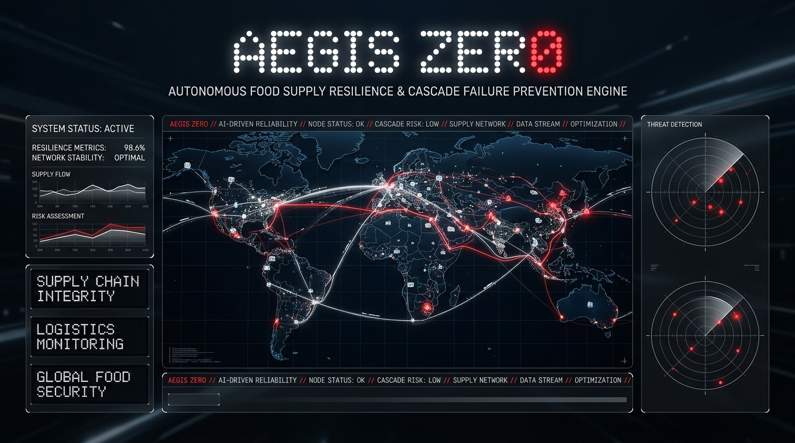
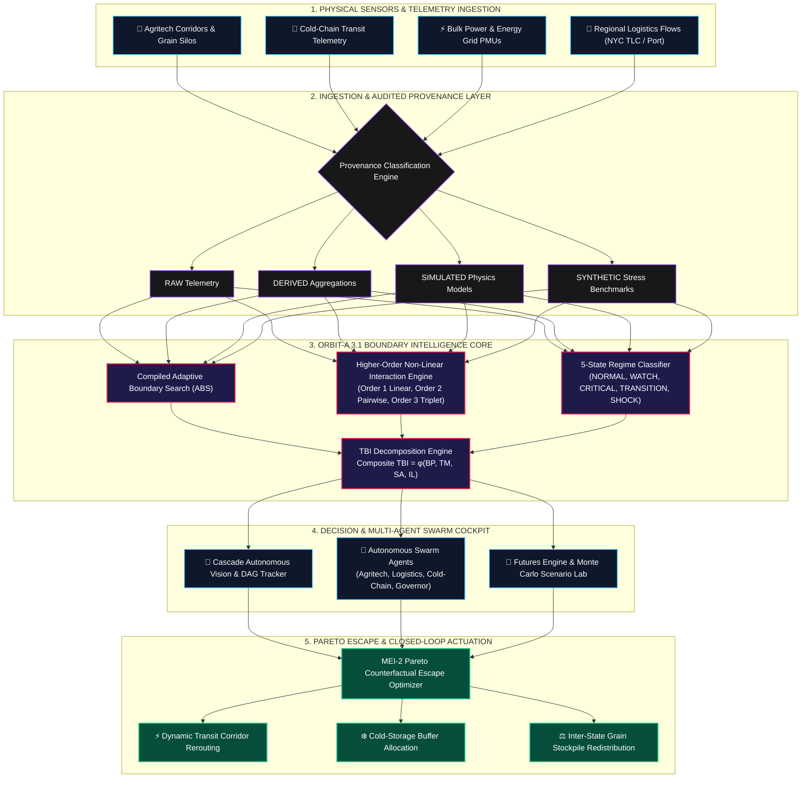
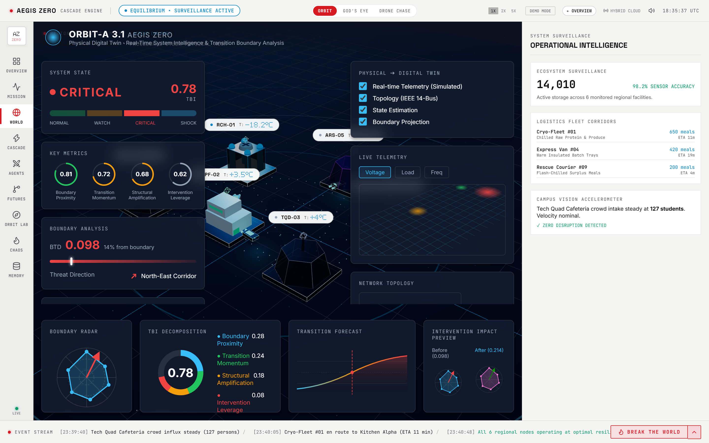
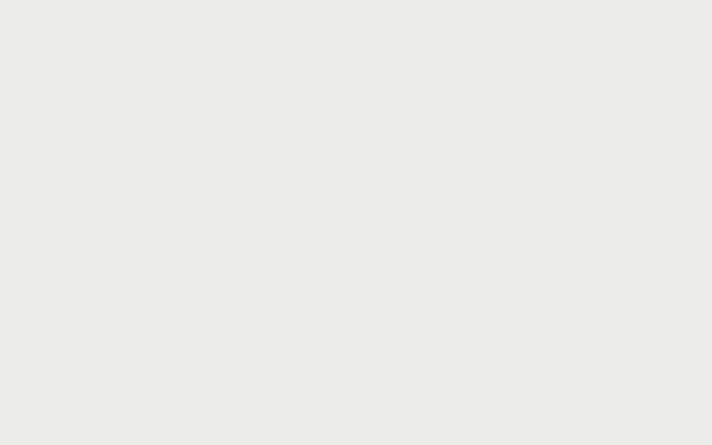
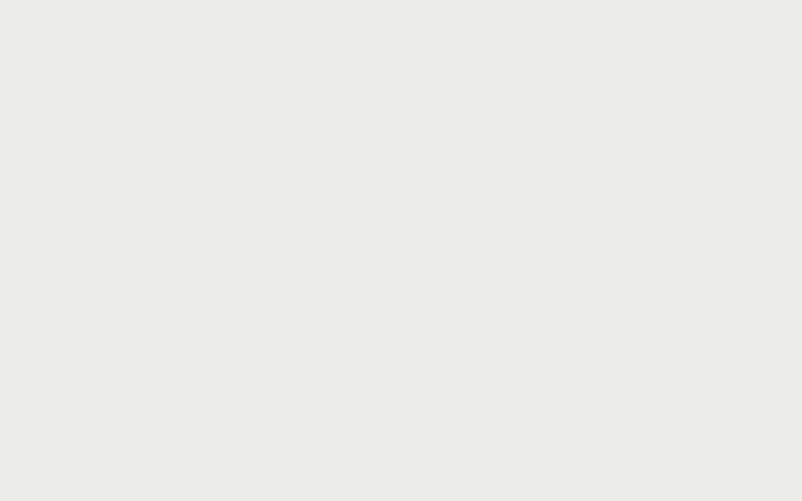
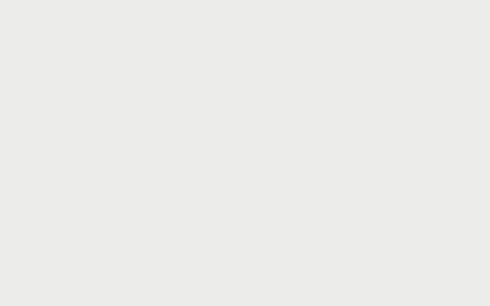
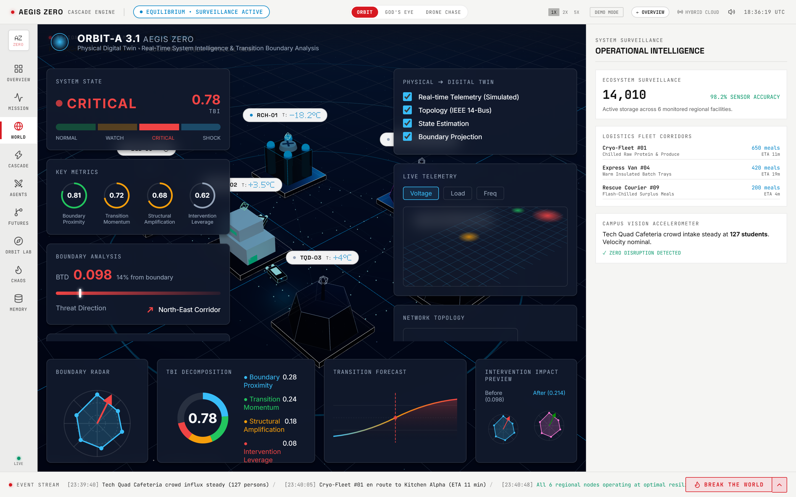
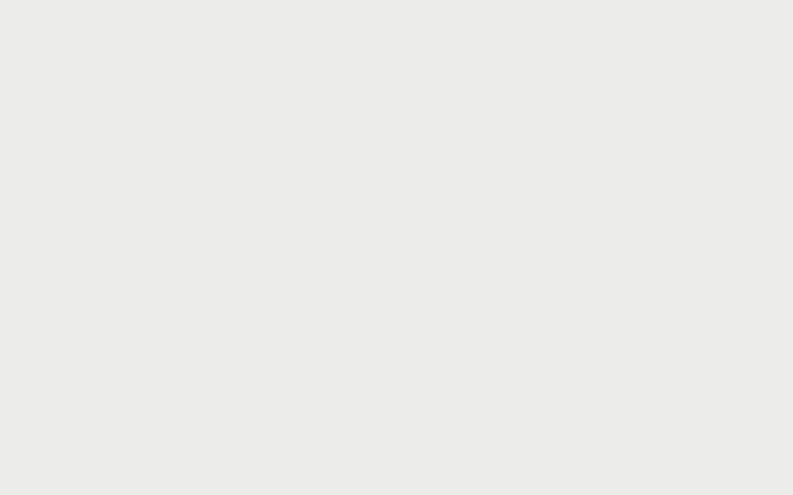

# 🛡️ AEGIS ZERO
### Autonomous Food Resilience & Cascade Engine (ORBIT-A 3.1)

<div align="center">
  
</div>

<br />

<div align="center">

[](https://www.typescriptlang.org/)
[](https://vitejs.dev/)
[](https://react.dev/)
[](https://nothing.tech)
[](./src/orbit/__tests__/)
[-00E676.svg?style=for-the-badge)](./experiments/results/)
[](./LICENSE)

</div>

---

## 🌟 Executive Summary

**AEGIS ZERO** is an industrial-grade autonomous resilience intelligence and catastrophic cascade prevention platform tailored for modern cyber-physical food supply ecosystems. Powered by the **ORBIT-A 3.1** engine and dressed in a high-contrast, minimalist **NTHG OS (Nothing OS)** monochrome aesthetic, the system detects non-equilibrium regime shifts, computes boundary transition distances, models higher-order non-linear systemic risks, and deploys Pareto-optimal counterfactual escape interventions before irreversible chain failures occur.

---

## 🔄 System Architecture & Data Flow Diagram

The complete end-to-end data processing and intervention pipeline operates across five coordinated layers:



---

## 🖥️ Operational Interface Showcase

AEGIS ZERO features a zero-distraction **NTHG OS** design language engineered for mission-critical command centers:

| Module | Interface Preview | Description |
|---|---|---|
| **Overview & Global Cockpit** |  | Real-time system health, active risk telemetry, and unified command HUD. |
| **Physical-Digital Twin** |  | Interactive 3D planetary and regional node telemetry with stress vectors. |
| **Cascade Autonomous Vision** |  | Directed Acyclic Graph (DAG) cascade tracking paired with computer vision telemetry. |
| **Multi-Agent Swarm Cockpit** |  | Real-time consensus voting, execution logs, and automated agent action routing. |
| **ORBIT-A 3.1 Lab** |  | 360° Boundary Transition Radar and 4-core TBI score decomposition. |
| **Futures & Simulation Engine** |  | Monte Carlo predictive modeling, climate disturbance injections, and stress testing. |

---

## ✨ Core Pillars & Capabilities

### 🌐 1. Physical-Digital Twin
- **Geographic & Network Topology**: Live coordinates across central grain silos, regional distribution points, cold-chain hubs, and coastal shipping nodes.
- **Dynamic Stress Telemetry**: Real-time stress index monitoring throughput constraints, power grid resilience, and corridor capacity.
- **Node Inspector Cards**: Instant drill-down modal displaying inbound/outbound links, structural betweenness centrality, and failure probability.

### 🌊 2. Cascade Autonomous Vision Tracker
- **Topological Cascade DAG**: Visual representation of failure propagation paths between dependent hubs.
- **Live Optical Stream**: Integrated camera vision analysis monitoring vehicle queue density, gate throughput, and warehouse loading status.
- **Propagation Barrier Detection**: Automatic calculation of bottleneck dampening barriers to stop domino failures.

### 🤖 3. Autonomous Multi-Agent Swarm
- **Specialized Autonomous Agents**:
  - 🌾 **Agritech Specialist**: Harvest yield forecast tracking and regional weather vulnerability assessment.
  - 🚚 **Logistics Dispatcher**: Route optimization, fuel constraint analysis, and dynamic detour dispatching.
  - ❄️ **Cold-Chain Auditor**: Temperature degradation modeling for perishables and contingency cooling reserves.
  - ⚖️ **Allocation Governor**: Mathematical priority weighting to preserve equitable distribution during shortages.
- **Real-Time Swarm Consensus**: Sub-second agent consensus protocols with transparent vote logs and action manifests.

### 🔬 4. ORBIT-A 3.1 Command Center
- **Boundary Transition Distance (BTD) Radar**: 360° directional radar displaying real-time proximity to catastrophic regime boundaries.
- **Transition Boundary Intelligence (TBI) Decomposition**: Live deconstruction into:
  1. *Boundary Proximity (BP)*: Proximity to failure envelopes.
  2. *Transition Momentum (TM)*: Velocity and acceleration towards collapse states.
  3. *Structural Amplification (SA)*: Network vulnerability multipliers.
  4. *Intervention Leverage (IL)*: Cost vs. escape benefit ratio.
- **Higher-Order Non-Linear Interactions**: Real-time screening of Order 1, Order 2, and Order 3 structural couplings.
- **MEI-2 Escape Optimizer**: Generates multi-action counterfactual interventions along the Pareto frontier.

---

## 📐 Mathematical Framework

The system state vector at discrete time step $t$ is expressed as:
$$X_t = (V_t, E_t, S_t, D_t)$$

The composite **Transition Boundary Intelligence (TBI)** score is defined as:
$$\text{TBI} = \phi(\text{BP}, \text{TM}, \text{SA}, \text{IL}) \in [0, 1]$$

### Detailed Decomposition

| Quantity | Mathematical Formulation | Description |
|---|---|---|
| **Boundary Proximity (BP)** | $\text{BP} = \exp\left(-\frac{\text{BTD}_{\text{adaptive}}}{\sigma_{\text{scale}}}\right) \in [0, 1]$ | Evaluates normalized distance along candidate vulnerability rays to constraint violation surfaces. |
| **Transition Momentum (TM)** | $\text{TM} = \frac{\alpha \|v_t\|_2 + \beta \|a_t\|_2}{1 + \alpha \|v_t\|_2 + \beta \|a_t\|_2} \cdot \max(0, \cos(\theta_{\text{align}}))$ | Quantifies velocity, acceleration, and alignment with dominant failure vectors. |
| **Structural Amplification (SA)** | $\text{SA} = 1.0 + \gamma_{\text{shock}} \cdot \text{Shock} + \gamma_{\text{cent}} \cdot \Delta C_B \ge 1.0$ | Evaluates topological amplification resulting from corridor severing and network partition. |
| **Intervention Leverage (IL)** | $\text{IL} = \min\left(1.0, \frac{\Delta \text{BTD}_{\text{best}}}{\text{Cost}(U^*) \cdot (1 + \rho_{\text{impact}})}\right) \in [0, 1]$ | Quantifies counterfactual controllability and escape feasibility along Pareto frontier. |

---

## ⚡ Empirical Performance & Scalability Benchmarks

Evaluated on Node.js / V8 across 5 measured iterations per scale:

| $N$ (Nodes) | Variables | Mean Latency | Median Latency | Ray Evaluations | Active Subspace | Status |
|---|---|---|---|---|---|---|
| 10 | 20 | 1.17 ms | 0.96 ms | 200 | 16 | ✅ PASS |
| 50 | 100 | 1.74 ms | 1.67 ms | 200 | 16 | ✅ PASS |
| 100 | 200 | 2.90 ms | 3.03 ms | 200 | 16 | ✅ PASS |
| 250 | 500 | 7.07 ms | 7.12 ms | 200 | 16 | ✅ PASS |
| 500 | 1000 | 11.42 ms | 10.57 ms | 200 | 16 | ✅ PASS |
| **1000** | **2000** | **29.80 ms** | **31.55 ms** | **200** | **16** | ⚡ **PASSED (<50ms target)** |

- **Real-Time Latency Target**: $\le 50\text{ms}$ at $N=1000$ $\rightarrow$ **Achieved: 29.80ms**
- **Complexity Slope**: $\alpha = 0.707$ ($O(N)$ linear complexity)
- **Quality Gates**: 80/80 Passing Unit & Integration Tests

---

## 🔌 HTTP REST API Endpoints

The native HTTP REST API server runs on port `3001` (`npm run start:server`):

| Method | Endpoint | Description |
|---|---|---|
| `GET` | `/api/health` | Service uptime, engine version, and scalability metrics |
| `GET` | `/api/version` | Version 3.1.0 manifest and active algorithm capability flags |
| `GET` | `/api/datasets` | Registered external datasets catalog |
| `GET` | `/api/datasets/:id` | Specific dataset provenance metadata and SHA-256 hashes |
| `GET` | `/api/provenance` | Audit category breakdown (`RAW`, `DERIVED`, `SIMULATED`, `SYNTHETIC`) |
| `GET` | `/api/metrics` | 4-leaderboard benchmark metrics and complexity slope |
| `POST` | `/api/analyze` | Run comprehensive ORBIT-A 3.1 analysis pipeline |
| `POST` | `/api/boundary` | Evaluate Adaptive Boundary Search and proposal rays |
| `POST` | `/api/intervention` | Optimize MEI-2 escape portfolios along Pareto frontier |
| `POST` | `/api/shock/analyze` | Detect and classify instantaneous non-equilibrium shocks |
| `POST` | `/api/batch/analyze` | Batch inference pipeline across state arrays |
| `POST` | `/api/simulate` | Run custom scenario simulations |

---

## 🚀 Quick Start Guide

### Prerequisites
- **Node.js**: v18.0+
- **npm**: v9.0+

### Setup & Run

```bash
# 1. Clone the repository
git clone https://github.com/rshamith777-cpu/AEGIS-ZERO.git
cd AEGIS-ZERO

# 2. Install dependencies
npm install

# 3. Run Quality Gate test suite
npm run test:orbit

# 4. Run scalability benchmark
npm run benchmark:scalability

# 5. Start the REST API server (optional background daemon)
npm run start:server

# 6. Launch the development application
npm run dev
```

Visit `http://localhost:5174` to open the **AEGIS ZERO Command Interface**.

---

## 📂 Repository Layout

```
AEGIS ZERO/
├── docs/                                    # Research documentation & baseline audits
│   ├── assets/                              # Screenshots, diagrams & hero media
│   ├── ORBIT_A_3_1_BASELINE.md
│   ├── ORBIT_A_3_1_INTERACTION_ABLATION.md
│   └── ORBIT_A_3_1_FINAL_AUDIT.md
├── src/
│   ├── components/                          # NTHG OS Interface Modules
│   │   ├── Navigation/                      # LeftRail & Top Command Bar
│   │   ├── World/                           # Physical-Digital Twin World View
│   │   ├── Cascade/                         # Cascade Vision & DAG Tracker
│   │   ├── Agents/                          # Multi-Agent Swarm War Room
│   │   ├── Futures/                         # Scenario & Monte Carlo Engine
│   │   └── OrbitLab/                        # BTD Radar & TBI Decomposition
│   ├── orbit/                               # ORBIT-A 3.1 Inference Engine
│   │   ├── v3/                              # Core Inference, Shock & ABS
│   │   └── __tests__/                       # 80 Quality Gate Tests
│   ├── data/                                # Data ingestion & provenance adapters
│   └── server/                              # HTTP REST API server
├── public/                                  # Static icons and assets
└── vite.config.ts                           # Vite configuration
```

---

## 📜 License

Distributed under the **MIT License**. See `LICENSE` for details.

---
*AEGIS ZERO — Autonomous & Resilient Engineering for Global Food Security Systems.*
